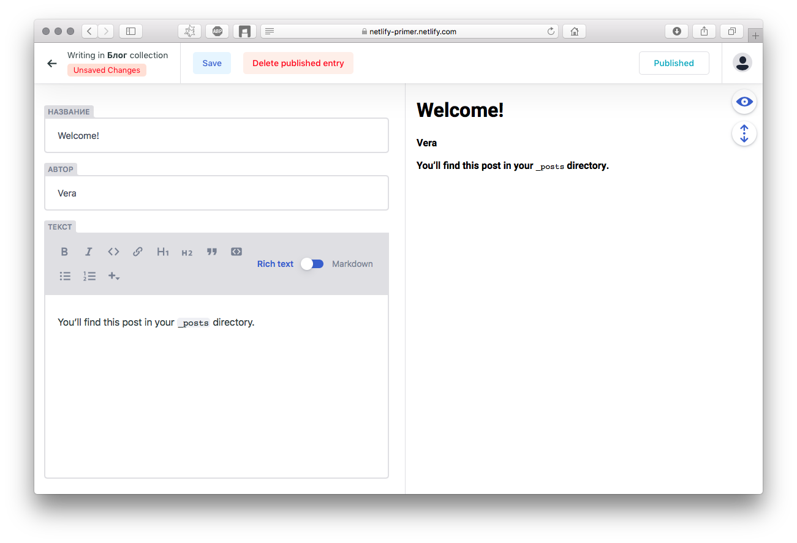

# Настраиваем Netlify CMS
---


## 1. Добавляем саму админку
Папка с файлами админки должна оказаться в папке со статическими файлами опубликованного сайта.
Где её размещать - зависит от того, чем собираем сайт:

| Эти генераторы…  | публикуют статику в: |
| ----- | ----- |
| Jekyll, GitBook | / (project root) |
| Hugo, Gatsby | /static |
| Hexo, Middleman | /source |

Т.к. у нас Jekyll, кладем папку с файлами админки в корень:

```html
mkdir admin
cd admin
touch config.yml index.html
```
В `admin/index.html` (это, собственно, стартовая страница админки) копируем вот этот код из [документации](https://www.netlifycms.org/docs/add-to-your-site/#app-file-structure):

```html
<!doctype html>
  <html>
  <head>
    <meta charset="utf-8" />
    <meta name="viewport" content="width=device-width, initial-scale=1.0" />
    <title>Content Manager</title>

    <!-- Include the styles for the Netlify CMS UI, after your own styles -->
    <link rel="stylesheet" href="https://unpkg.com/netlify-cms@^1.0.0/dist/cms.css" />

  </head>
  <body>
    <!-- Include the script that builds the page and powers Netlify CMS -->
    <script src="https://unpkg.com/netlify-cms@^1.0.0/dist/cms.js"></script>
  </body>
</html>
```

## 2. Добавляем аутентификацию
Нетлифай цмс размещает новый контент в репозитории проекта на гитхабе, поэтому обязательна аутентификация.
Можно использовать разные варианты аутентификации, но в любом случае для неё нужен сервер – либо свой, либо какой-то сторонний сервис. Подробнее - в [документации](https://www.netlifycms.org/docs/authentication-backends/).


Наш проект размещен на CDN Нетлифай, так что можем использовать их сервис аутентификации Netlify Identity. Это самый простой путь. Все шаги по настройке этого сервиса мы уже выполнили на предыдущем этапе создания проекта, осталось добавить аутентификацию в админку.

1. Добавляем вот этот виджет в `<head>` главной страницы админки (`admin/index.html`), а также в `<head>` главной страницы сайта (в нашем проекте - в `_includes/head.html`)

  ```html
  <script src="https://identity.netlify.com/v1/netlify-identity-widget.js"></script>
  ```

2. По умолчанию после логина пользователь будет снова видеть главную страницу сайта. Чтобы после логина он сразу попадал в админку, добавляем этот скрипт также на главную страницу сайта (в нашем случае - в `_layouts/home.html`)

```html
<script>
  if (window.netlifyIdentity) {
    window.netlifyIdentity.on("init", user => {
      if (!user) {
        window.netlifyIdentity.on("login", () => {
          document.location.href = "/admin/";
        });
      }
    });
  }
</script>
```
3. В `admin/config.yml` указываем выбранный способ аутентификации.

```yaml
backend:
  name: git-gateway
  branch: master
```
Ветка - та, в которую цмска будет коммитить добавленный через нее контент. По умолчанию - мастер. Как правило, нужно указывать ту ветку, из которой собирается и деплоится сайт.

## 3. Настраиваем админку
### Editorial workflow
По дефолту, Нетлифай цмс сразу коммитит новые записи. Эдиториал воркфлоу позволяет добавить процесс одобрения новых постов. Чтобы его включить, добавляем
```yaml
publish_mode: editorial_workflow
```
в `admin/config.yml`.

### Папка для медиа
Нужно обязательно указать место, куда цмска будет сохранять добавленные через нее медиафайлы. Создаем папку /media и знакомим с ней цмску:

В `admin/config.yml`:
```yaml
media_folder: "/media"
```

### Коллекции
Это - самое основное, ради чего всё и делалось.
Коллекция может быть:
- в виде набора одинаково структурированных файлов в папке
- в отдельном файле, форматированная в соответствии с указанным синтаксисом.

Можно указать нужное расширение и формат файлов. У нас всё по умолчанию: коллекция в папке - в маркдауне, коллекция в файле - в yml.

В `admin/config.yml` добавляем элемент
```yaml
collections:
```
А в него, в виде списка - наши коллекции.

Цмска будет собирать данные и сохранять их в нужную коллекцию. Дальше можно использовать эти данные как угодно. Шаблонизатор Liquid в нашем проекте отлично работает с данными коллекций.


#### Коллекция в папке
Подходит, например, для постов в блоге. Настраиваем коллекцию в `admin/config.yml`:

```yaml
collections:
  - name: "posts"
      label: "Блог"
      create: true
      folder: "_posts"
      slug: "{{year}}-{{month}}-{{day}}-{{slug}}"
      fields:
        - {label: "Layout", name: "layout", widget: "hidden", default: "post"}
        - {label: "Название", name: "title", widget: "string"}
        - {label: "Автор", name: "author", widget: "string"}
        - {label: "Текст", name: "body", widget: "markdown"}
```

`slug` - это шаблон, по которому новые файлы будут именоваться.
`create: true` означает, что можно создавать новые файлы в папке коллекции.
`fields` - это поля, которые цмска будет заполнять.  `name` – это имя поля, `label` - это название поля в интерфейсе цмски, виджет – поле ввода с нужным функционалом.

В итоге у нас получится файл такой структуры:

```
---
layout: post
title:  "Some title"
author: Vera
---
Some content
```

Окно редактирования в админке выглядит вот так:


В нашем проекте шаблонизатор уже правильно выводит данные постов, так что здесь всё готово.

#### Коллекция в файле
Сделаем коллекцию с настройками контента главной страницы – названия и текста.
Создаем в корне папку `_data`, в которой будут лежать файлы разных коллекций.
В ней - файл нашей коллекции `_data/hello.yml`.

Сначала надо указать, что мы собираемся делать файловые коллекции:
```yaml
  - name: "settings"
    label: "Настройки"
    files:
```
Нужно следить, чтобы этот элемент списка внутри `collections:` был на том же уровне, что и элемент списка с коллекцией постов, т.к. ямл ревностно относится к правильной индентации.

Потом настраиваем каждую коллекцию отдельно:

 ```yaml
   - name: "settings"
     label: "Настройки"
     files:
     - name: "hello"
       label: "Главная"
       file: "_data/hello.yml"
       fields:
         - { label: "Заголовок", name: "title", widget: "string"}
         - { label: "Текст", name: "text", widget: "markdown" }
```
Потом, уже в админке, мы сможем добавить текст главной страницы, и в итоге у нас получится файл такой структуры:

```yaml
title: "Привет!"
text: |-
  Это мини-туториал о том,
  - [как сделать сайт на Джекиле и разместить его на Netlify CDN](site-setup)
  - [и как добавить к нему админку Netlify CMS](cms-setup)
```
А чтобы получить доступ к этим данным и выводить их на нашей главной страничке, добавим вот такой шаблон в `_layouts/home.html`:
```html
<div class="home">

  
    <h1 class="page-heading">{{ site.data.hello.title }}</h1>
  

  {{ site.data.hello.text | markdownify }}

</div>
```
Пушим коммиты в мастер. Нетлифай пересоберет сайт, и изменения опубликуются.

Готово! Подключили админку и создали две коллекции разных типов.
